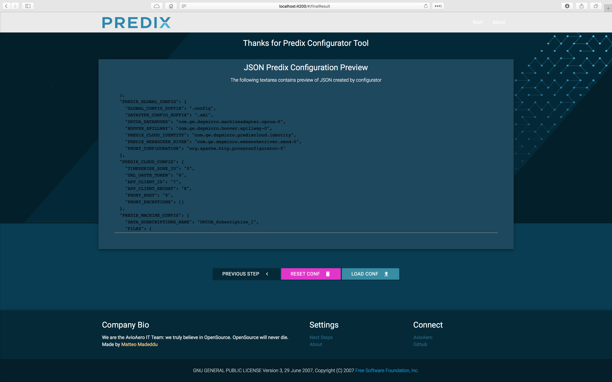

# Predix Configurator

A [Predix](http://predix.io)&copy; configurator tool (cli) written in Python + an angular2 webapp to help you manage your Edge Connectivity stack, from machines in your factory to Predix microservices in your cloud space.

### Factory stack

__Note__: the tool is intended for a factory infrastructure like the one below:


As you can see, the working schema involves:

- Use of a machine-protocol gateway able to handle several industrial communication protocols used by different machines. For our purpose we used [IGS](http://www.geautomation.com/node/12978) by [GE Automation](http://www.geautomation.com);
- Use of a Predix Machine (you can find pre-configured version of Predix Machine [here](https://github.com/PredixDev/predix-machine-templates) and other useful starting template for your application in [Predix Dev](https://github.com/PredixDev)'s Github page);
- Available cloud space in Predix Platform;

### How it works

The tool is intended for both Predix dev / common users. I prepared two different step-by-step guidelines:

- [Old-school way](#oldschoolway): prepare your JSON schema manually => run the configuration tool => enjoy.

- [Third Millennium way](#thirdmillenniumway): prepare your JSON schema through the use of a stunning serverless web app XD => run the configuration tool => enjoy.

### <a name="oldschoolway"></a> How it works: old-school way

The only script you need is the python script under the folder ```cli/``` named ```predix-configurator.py```: you can run it from your command line simply moving in the ```cli/``` folder and running:
 
 ```
 python predix-configurator.py
 ```
 
When ```predix-configurator``` starts, it looks for a configuration file under the folder ```schema``` called ```your-factory.json``` (you can change the name of the file and update the const value in the header of the script with the new name / path as well).

A ```your-factory.json``` schema is already available in ```schema``` folder: for obvious reasons, I can't provide more details using real parameters instances XD.

#### JSON Schema details

The ```GLOBAL_CONFIG``` key in the root of JSON specify the output path of python-configurator. When you run the ```predix-configurator.py```, generated configuration files will be created in the ```GLOBAL_CONFIG.OUTPUT_DIR``` folder.

```
{
	"GLOBAL_CONFIG" : {

		"OUTPUT_DIR" : "./config/"

	},
}
```
The ```GLOBAL_IGS_CONFIG``` key in the root of JSON specify [IGS](http://www.geautomation.com/node/12978) parameters. The most important parameter is ```SERVER_URI```, that specify ```opcua``` endpoint exposed by your IGS instance to Predix Machine.
```
{
	"IGS_CONFIG" : {

		"SERVER_URI" : "opc.tcp://localhost:49310",
		"APP_URI" : "urn:localhost:Intellution.IntellutionGatewayOPCServer:UA Client Driver",
		"PRODUCT_URI" : "urn:localhost:UA:PredixMachine_OPCUAAdapter",
		"NAMESPACE_INDEX" : "your.namespace.index"
	},
}
```
The ```PREDIX_GLOBAL_CONFIG``` key in the root of JSON specify [Predix Machine](https://github.com/PredixDev/predix-machine-templates) most-important configuration file names and extensions. This field is intended to provide more flexibility to future version of Predix Machine.
```
	"PREDIX_GLOBAL_CONFIG" : {

		"GLOBAL_CONFIG_SUFFIX" : ".config",
		"DATATYPE_CONFIG_SUFFIX" : ".xml",
		"OPCUA_DATANODES" : "com.ge.dspmicro.machineadapter.opcua-0",
		"HOOVER_SPILLWAY" : "com.ge.dspmicro.hoover.spillway-0",
		"PREDIX_CLOUD_IDENTITY" : "com.ge.dspmicro.predixcloud.identity",
		"PREDIX_WEBSOCKER_RIVER" : "com.ge.dspmicro.websocketriver.send-0",
		"PROXY_CONFIGURATION" : "org.apache.http.proxyconfigurator-0"

	},
```
The ```PREDIX_CLOUD_CONFIG``` key in the root of JSON specify [Predix Cloud](https://www.ge.com/digital/predix) most-important configuration parameters. Here you can define your timeseries Zone-ID (env vars), UAA parameters and proxy (if needed by your organization).
```
	"PREDIX_CLOUD_CONFIG" : {

		"TIMESERIES_ZONE_ID" : "",
		"URL_OAUTH_TOKEN" : "",
		"APP_CLIENT_ID" : "",
		"APP_CLIENT_SECRET" : "",
		"PROXY_HOST" : "",
		"PROXY_EXCEPTIONS" : []

	},
```

TODO OTHER FIELD: Change in progress in logic to provide better support between ```Typescript``` model and ```JSON``` output struct.

### <a name="thirdmillenniumway"></a> How it works: Third Millennium way

I create an angular2-based webapp to help you create your ```your-factory.json``` configuration file. The app will guide you through various step, but you can always see in real time the preview of your json configuration changing over time.

##### Welcome Page


##### IGS Configuration Page


##### Predix Global Configuration


##### Predix Cloud Configuration


##### Result Configuration


TODO OTHER FIELD: Change in progress in presentation level due to angular2 exp in progress.

### Thank you

- [cwun](https://github.com/cwun), I was really inspired by your multi-step wizard using UI-Router 1.0 and TypeScript 2.0.10.