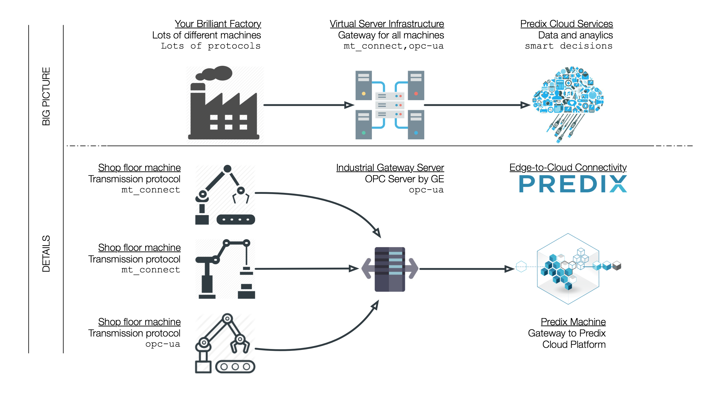
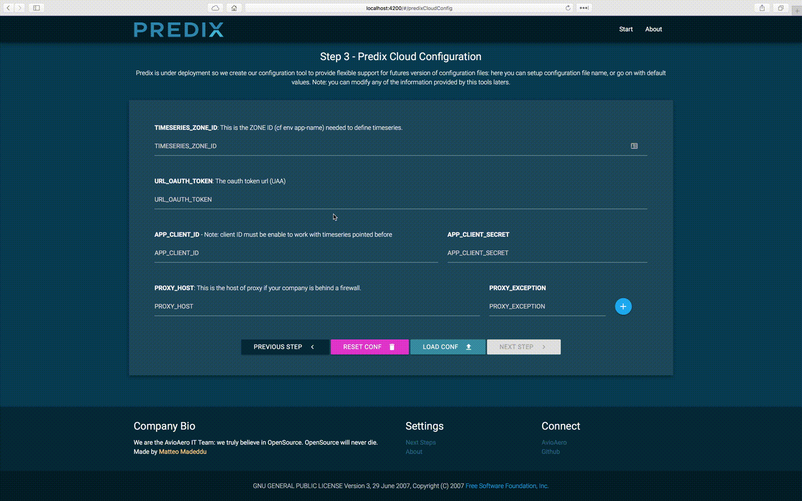
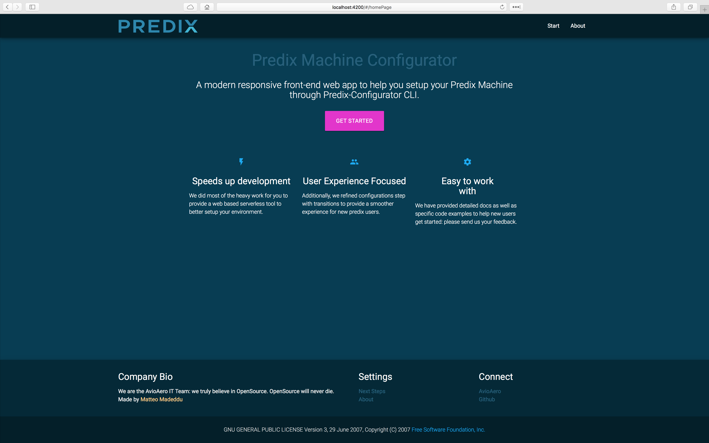
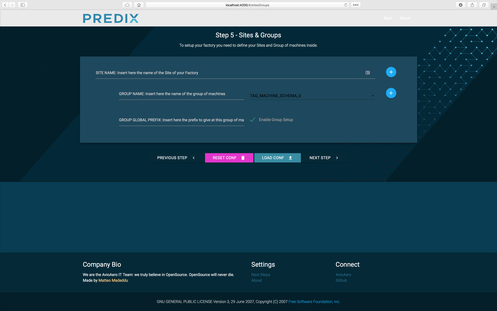

# Predix Configurator

A [Predix](http://predix.io)&copy; configurator tool (cli) written in Python + an angular2 webapp to help you manage your Edge Connectivity stack, from machines in your factory to Predix microservices in your cloud space.

### Factory stack

__Note__: the tool is intended for a factory infrastructure like the one below:



As you can see, the working schema involves:

- Use of a machine-protocol gateway able to handle several industrial communication protocols used by different machines. For our purpose we used [IGS](http://www.geautomation.com/node/12978) by [GE Automation](http://www.geautomation.com);
- Use of a Predix Machine (you can find pre-configured version of Predix Machine [here](https://github.com/PredixDev/predix-machine-templates) and other useful starting template for your application in [Predix Dev](https://github.com/PredixDev)'s Github page);
- Available cloud space in Predix Platform;

### How it works

The tool is intended for both Predix dev / common users. I prepared two different step-by-step guidelines:

- [Old-school way](#oldschoolway): prepare your JSON schema manually => run the configuration tool => enjoy.

- [Third Millennium way](#thirdmillenniumway): prepare your JSON schema through the use of a stunning serverless web app XD => run the configuration tool => enjoy.

### <a name="oldschoolway"></a> How it works: old-school way

The only script you need is the python script under the folder ```cli/``` named ```predix-configurator.py```. The script has only one dependency to pretty print xml to file.
You can run it from your command line simply following this step:
 
 ```
 git clone https://github.com/made2591/predix-configurator
 cd predix-configurator
 cd cli
 #[optional create venv] virtualenv .venv & source .venv/bin/activate
 pip install requirements.txt
 python predix-configurator.py
 ```
 
When ```predix-configurator``` starts, it looks for a configuration file under the folder ```schema``` called ```your-factory.json``` (you can change the name of the file and update the const value in the header of the script with the new name / path as well).

A ```your-factory.json``` schema is already available in ```schema``` folder: for obvious reasons, I can't provide more details using real parameters instances XD.

#### JSON Schema details

##### GLOBAL_CONFIG

The __```GLOBAL_CONFIG```__ key in the root of JSON specify the output path of python-configurator. When you run the ```predix-configurator.py```, generated configuration files will be created in the ```GLOBAL_CONFIG.OUTPUT_DIR``` folder.

```
{
	"GLOBAL_CONFIG" : {

		"OUTPUT_DIR" : "./config/"

	},
}
```

##### GLOBAL\_IGS\_CONFIG

The __```GLOBAL_IGS_CONFIG```__ key in the root of JSON specify [IGS](http://www.geautomation.com/node/12978) parameters. The most important parameter is ```SERVER_URI```, that specify ```opcua``` endpoint exposed by your IGS instance to Predix Machine.
```
{
	"IGS_CONFIG" : {

		"SERVER_URI" : "opc.tcp://localhost:49310",
		"APP_URI" : "urn:localhost:Intellution.IntellutionGatewayOPCServer:UA Client Driver",
		"PRODUCT_URI" : "urn:localhost:UA:PredixMachine_OPCUAAdapter",
		"NAMESPACE_INDEX" : "your.namespace.index"
	},
}
```

##### PREDIX\_GLOBAL\_CONFIG

The __```PREDIX_GLOBAL_CONFIG```__ key in the root of JSON specify [Predix Machine](https://github.com/PredixDev/predix-machine-templates) most-important configuration file names and extensions. This field is intended to provide more flexibility to future version of Predix Machine.

```
	"PREDIX_GLOBAL_CONFIG" : {

		"GLOBAL_CONFIG_SUFFIX" : ".config",
		"DATATYPE_CONFIG_SUFFIX" : ".xml",
		"OPCUA_DATANODES" : "com.ge.dspmicro.machineadapter.opcua-0",
		"HOOVER_SPILLWAY" : "com.ge.dspmicro.hoover.spillway-0",
		"PREDIX_CLOUD_IDENTITY" : "com.ge.dspmicro.predixcloud.identity",
		"PREDIX_WEBSOCKER_RIVER" : "com.ge.dspmicro.websocketriver.send-0",
		"PROXY_CONFIGURATION" : "org.apache.http.proxyconfigurator-0"

	},
```

##### PREDIX\_CLOUD\_CONFIG

The __```PREDIX_CLOUD_CONFIG```__ key in the root of JSON specify [Predix Cloud](https://www.ge.com/digital/predix) most-important configuration parameters. Here you can define your timeseries Zone-ID (env vars), UAA parameters and proxy (if needed by your organization) with exceptions.
The files involved by these keys are the one pointed by ```PREDIX_GLOBAL_CONFIG.PREDIX_WEBSOCKER_RIVER```, ```PREDIX_GLOBAL_CONFIG.PREDIX_CLOUD_IDENTITY``` and ```PREDIX_GLOBAL_CONFIG.PROXY_CONFIGURATION```.

```
	"PREDIX_CLOUD_CONFIG": {

		"TIMESERIES_ZONE_ID": "f37*****-****-****-****-************",
		"URL_OAUTH_TOKEN": "https://********-****-****-****-************.*****************/oauth/token",
		"APP_CLIENT_ID": "**********",
		"APP_CLIENT_SECRET": "**********",
		"PROXY_HOST": "**********",
		"PROXY_EXCEPTIONS": [
			"**********"
		]

	},
```

You can add more then one exception from Webgui (see below).



##### TAG\_MAPPING\_SCHEMA

The __```TAG_MAPPING_SCHEMA```__ key in the root of JSON specify Tag Mapping between your Predix Cloud application and [IGS](http://www.geautomation.com/node/12978) (or your collector): it is a dict, with key defining Tag Mapping schema names, and values, the respective content of the schema.
The file involved by these keys are the one pointed by ```PREDIX_GLOBAL_CONFIG.OPCUA_DATANODES```.

__NOTE__: each Tag Schema have to be named: if you procede without giving a name to a Tag Schema, a default name will be assigned to the schema. Further, each Tag Couple has to be "headed" with a destination tags: if you procede without giving a name to a Tag Couple (pairing), a default head tag will be assigned. This logic is intended to prevent losing of partial setup during step.

```
	"TAG_MAPPING_SCHEMA": {

		"tag_mapping_schema_1": {

			"CHANNEL_PREFIX": "channel_prefix_1",
			"MAPPING": {
				"PREDIX_TAG_1": "MACHINE_TAG_1",
				"PREDIX_TAG_2": "MACHINE_TAG_2",
				"PREDIX_TAG_3": "MACHINE_TAG_3",
				"PREDIX_TAG_4": "MACHINE_TAG_4",
				"PREDIX_TAG_5": "MACHINE_TAG_5",
				"PREDIX_TAG_6": "MACHINE_TAG_6",
				"PREDIX_TAG_7": "MACHINE_TAG_7",
				"PREDIX_TAG_8": "MACHINE_TAG_8",
				"PREDIX_TAG_9": "MACHINE_TAG_9"
			}

		},

		"tag_mapping_schema_2": { ... },
		... // other schema go here

	}
```

You can easly add new Tag Schema using web app.


### <a name="thirdmillenniumway"></a> How it works: Third Millennium way

I create an angular4-based webapp to help you create your ```your-factory.json``` configuration file. The app will guide you through various step, but you can always see in real time the preview of your json configuration changing over time. You can setup your app to run locally or use the one host on [TODO](https://predix-configurator.github.io)

#### Setup Webapp to run locally

Make sure you have [NPM](https://www.npmjs.com/get-npm) and [AngularCLI](https://cli.angular.io) installed on your machine. Then:

```
git clone https://github.com/made2591/predix-configurator
cd predix-configurator/webgui
npm install
ng serve
```

And point your browser to [http://localhost:4200/](http://localhost:4200/)

##### Welcome Page


##### STEP 1: IGS Configuration Page


##### STEP 2: Predix Global Configuration


##### STEP 3: Predix Cloud Configuration


##### STEP 4: Tag Schemas Configuration


##### STEP 5: Sites Groups Configuration


##### STEP 6: Machines Configuration
TODO YET

##### STEP 7: Result
TODO YET

### Thank you

- [cwun](https://github.com/cwun), I was really inspired by your multi-step wizard using UI-Router 1.0 and TypeScript 2.0.10.